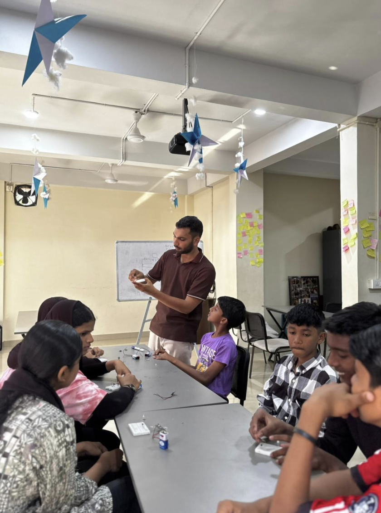
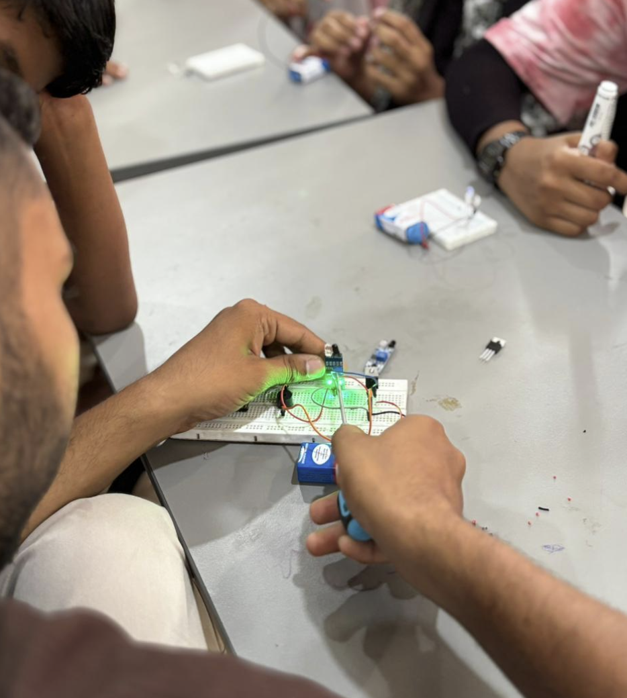
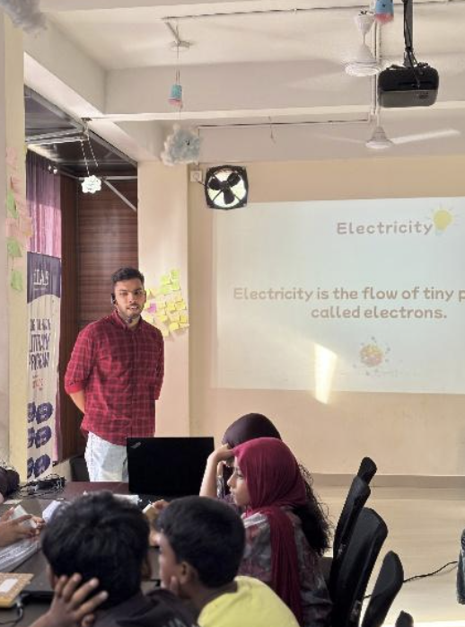
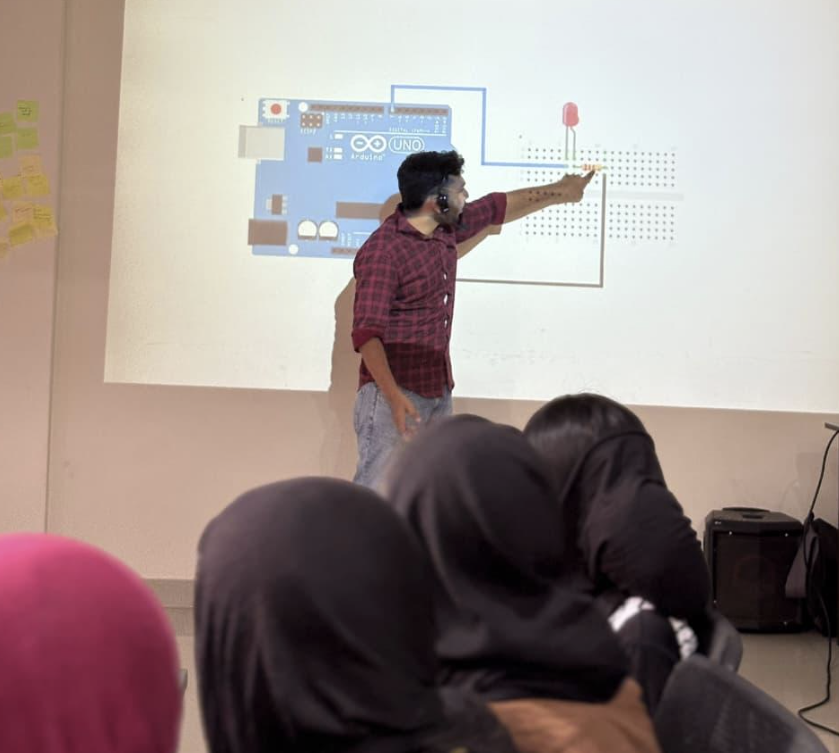

## Overview

Introductory STEM session for 15 students at iLab. Covered the basics of electricity and circuits, with hands-on LED and Arduino activities.

<!-- more -->

## Participants

- 15 students

## Topics

- What is electricity
- How circuits work
- LEDs — what they are and how to use them
- Basic coding to blink an LED
- Arduino UNO intro

## Activities

- Slide walkthrough on electricity basics
- Live Arduino + breadboard + LED demo
- Students experimented with circuit connections and wrote blink code

## Photos

### Session Overview

### Hands-on Circuit Building

### Electricity Introduction

### Arduino Circuit Demo

## Highlights

- Students grasped electron flow quickly with a simple analogy
- Seeing code control a physical LED was a big "wow" moment
- Lots of questions and curiosity throughout

