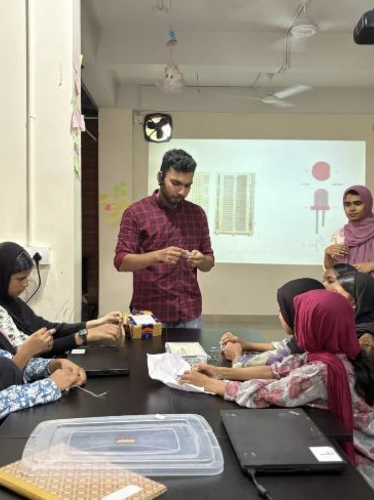
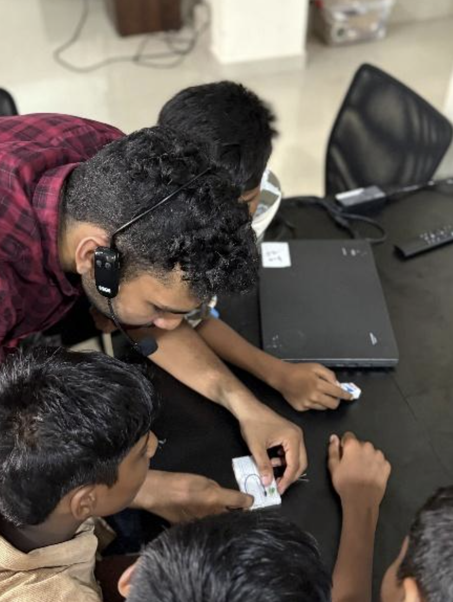

## Overview

Hands-on session at Skill Hub for 12 students covering the fundamentals of electronics and microcontroller programming using Arduino Uno.

<!-- more -->

## Participants

- 12 students
- Venue — Skill Hub

## Topics

- Current, voltage, and resistance
- How electrical circuits work
- Reading and using a breadboard
- Introduction to Arduino Uno — power pins and digital pins
- Uploading and modifying an Arduino sketch
- Digital output control

## Activities

- Built a simple LED + resistor circuit on a breadboard
- Uploaded first Arduino sketch — LED blink program
- Traffic light simulation
- LED pattern lights
- Buzzer basics

## Photos

### Hands-on Circuit Building

### Mentoring One-on-One

## Highlights

- Students successfully built their first circuits from scratch
- Seeing an LED blink from their own code was a big confidence booster
- Traffic light simulation made real-world connections click
- Students left with confidence in both electronics and coding
