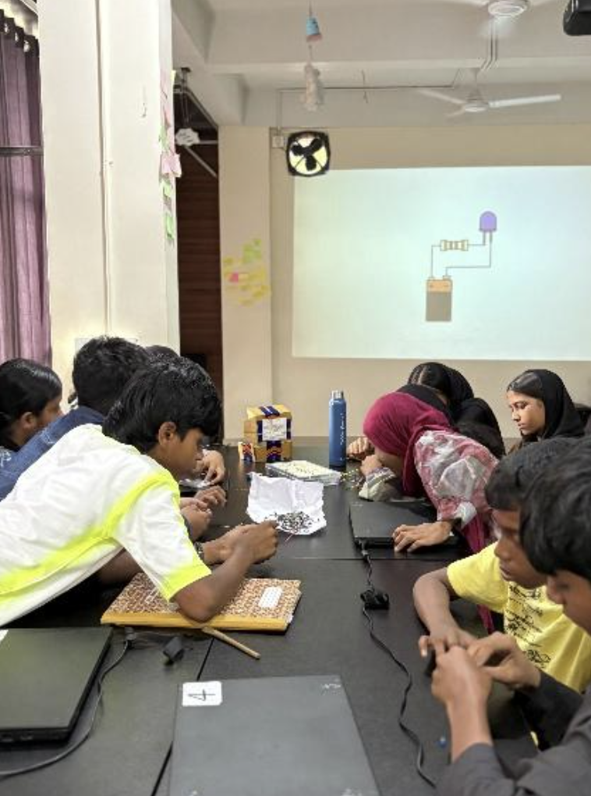

## Overview

Session at Skill Hub for 12 students focused on sensors and their real-world applications, with hands-on use of the IR reflective sensor for detection and automation tasks.

<!-- more -->

## Participants

- 12 students
- Venue — Skill Hub

## Topics

- How IR transmitters and receivers work
- Digital output readings from sensors
- Object and obstacle detection using IR sensors
- Serial Monitor — monitoring sensor states

## Activities

- LED turns ON when an object is detected
- Buzzer activates based on sensor input
- Combined IR-based LED + buzzer alarm system

## Photos

### Students Working on Sensor Circuits

## Highlights

- Students connected sensors to real outputs (LED + buzzer) — automation clicked instantly
- Serial Monitor helped students visualise sensor readings live
- The alarm system activity brought everything together in a satisfying way
- Logical thinking and problem-solving were strongly applied throughout
