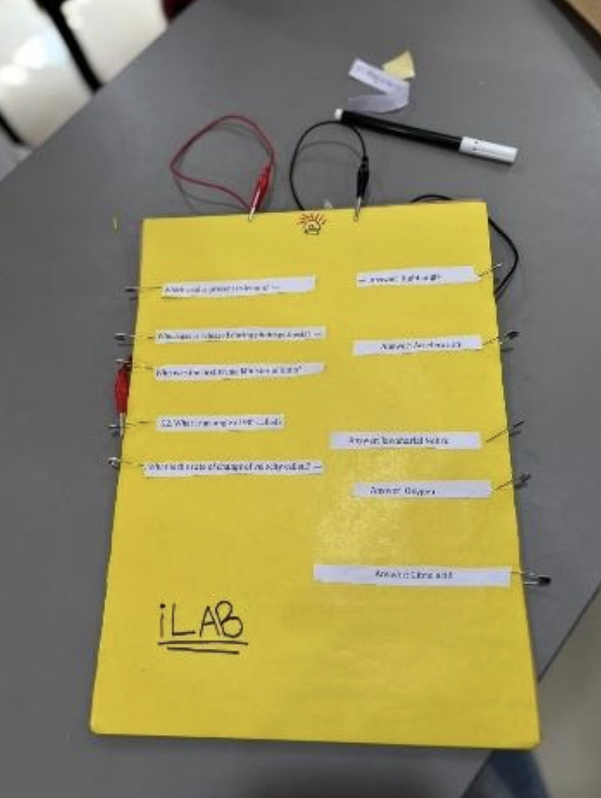
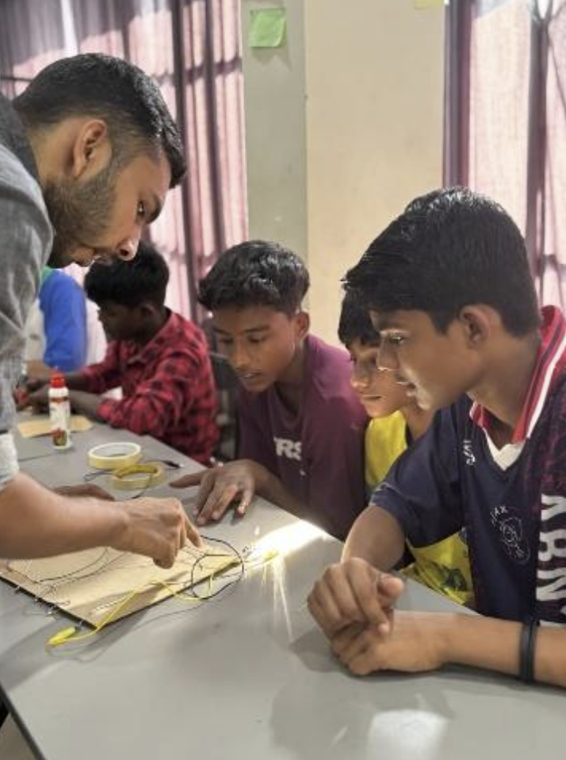

## Overview

9 students at Skill Hub built and tested their own LED quiz boards, linking basic circuit concepts with hands-on making and peer learning.

<!-- more -->

## Participants

- 9 students
- Venue — Skill Hub

## Topics

- How electricity flows in a circuit
- How LEDs respond to correct connections
- Circuit building — wires, batteries, and LEDs

## Activities

- Built LED quiz boards from scratch
- Green LED lights up for correct answers
- Red LED lights up for incorrect answers
- Students tested, corrected mistakes, and discussed observations independently

## Photos

### The LED Quizboard

### Students Building Their Boards

## Highlights

- Students independently debugged their own circuits — big confidence win
- The correct/incorrect LED feedback made learning feel like a game
- Teamwork and peer discussion were strong throughout
- Sparked genuine interest in electronics and learning by doing
