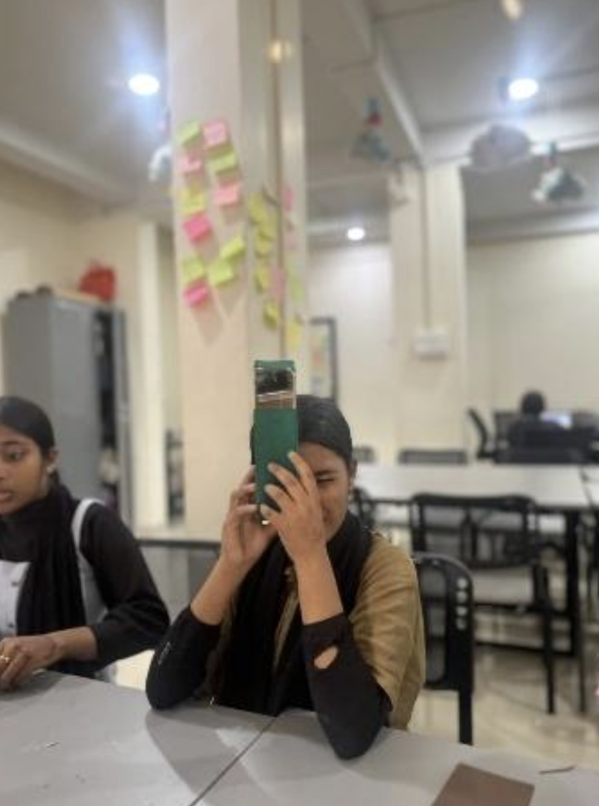
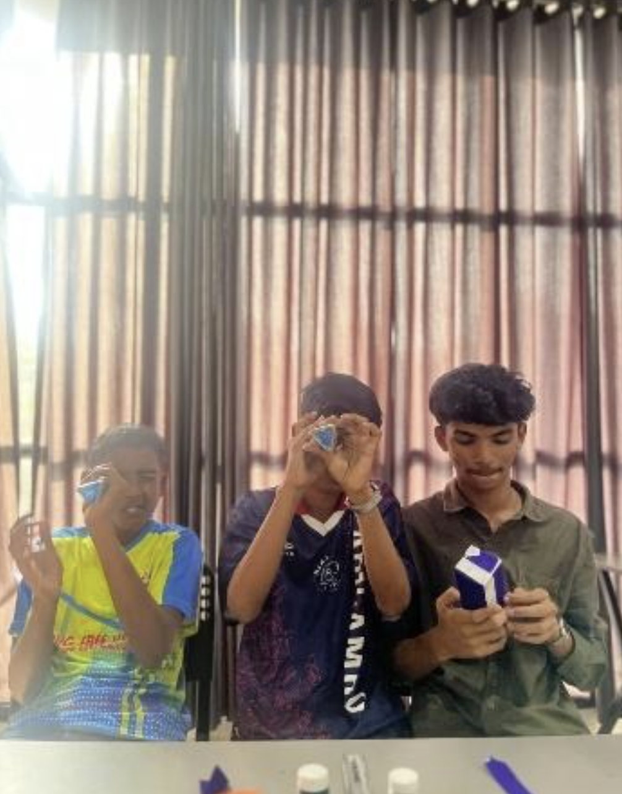

## Overview

9 students at Skill Hub built their own periscopes and kaleidoscopes using cardboard and mirrors, exploring the science of light and reflection through hands-on making.

<!-- more -->

## Participants

- 9 students
- Venue — Skill Hub

## Topics

- How periscopes and kaleidoscopes work
- Real-life applications of both devices
- Laws of reflection

## Activities

- Built periscopes using cardboard and mirrors placed at correct angles
- Built kaleidoscopes and explored colourful reflection patterns
- Tested models by viewing objects from different heights and angles
- Shared observations and compared results with peers

## Photos

### Session at Skill Hub

### Students with Their Kaleidoscopes

## Highlights

- Students independently assembled working models from scratch
- Seeing real light reflections inside their own builds was a wow moment
- Connected periscope concepts to submarines and real-world use cases
- Creativity was on full display in how students decorated their models
