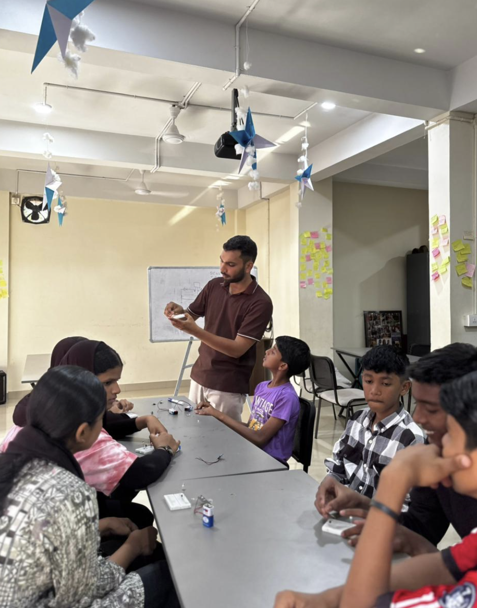

## Overview

13 students at Skill Hub built a working automatic street light using an LDR sensor, learning how transistors act as switches and how sensors drive real-world automation.

<!-- more -->

## Participants

- 13 students
- Venue — Skill Hub

## Topics

- Sensors and their real-world applications
- How transistors function as switches
- LDR — how it detects light intensity

## Activities

- Assembled circuit using LDR, transistor, LED, and battery
- Tested the circuit under different light conditions
- Observed how light intensity changes triggered the LED
- Troubleshot and refined circuit connections

## Photos

### Session — LDR Circuit Building

## Highlights

- Students explained independently how the LDR controls the LED through the transistor
- Testing under different light conditions made the automation concept click
- Strong curiosity and engagement during circuit building
- Connected directly to real-life street lighting applications
